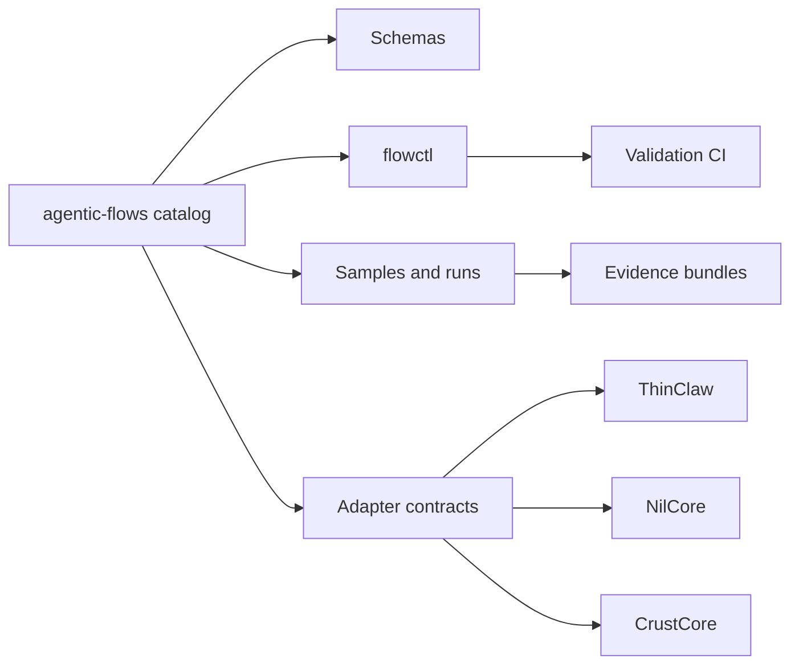

# agentic-flows

[](https://github.com/RNT56/agentic-flows/actions/workflows/validate.yml)

Versioned workflow contracts for agentic systems that must plan, act, verify, approve, and leave evidence.

`agentic-flows` is the portable workflow layer for RNT56 agentic projects. It defines reusable flow specs, schemas, samples, run bundles, adapter contracts, and release gates that independent runtimes can choose to consume. It is not a fourth runtime and it does not merge ThinClaw, NilCore, or CrustCore into one codebase.

| Surface | Current state |
| --- | --- |
| Latest release | `v0.1.1` |
| Flow spec | `agentic-flows/v1` |
| Catalog size | 52 reusable workflows, 3 starter templates |
| Tooling | Python CLI, JSON Schema, YAML flow definitions |
| Evidence model | Events, streams, run bundles, adapter smoke manifests |
| CI gate | Schema validation, normalization, samples, runs, links, changelog, package build, tests |
| Backlog | [todo-workflows.md](todo-workflows.md) |

## Vision

Agentic work should not be a loose prompt transcript. It should be an explicit, inspectable contract:

1. Inputs are named.
2. Execution steps are bounded.
3. Approvals are intentional.
4. Quality gates are machine-checkable.
5. Completion comes with evidence.
6. Consumers can pin versions instead of guessing what changed.

This repository gives RNT56 projects a shared workflow language without forcing a shared runtime. A flow can describe how a feature implementation, refactor, security audit, research report, human approval, or multi-agent supervision loop should behave. Each independent project decides whether to load it, adapt it, copy it, or ignore it.

## Project model



`agentic-flows` owns the contract. Runtime ownership stays outside this repo.

| Optional consumer | Natural role | What it would consume |
| --- | --- | --- |
| ThinClaw | Durable routines, memory, channels, operator decisions | Flow references, approval nodes, routine state, decision records |
| NilCore | Sandboxed worker execution and supervision | Agent tasks, tool nodes, worker-dispatch events, run evidence |
| CrustCore | Verifier-owned proof and audit boundaries | Quality gates, evidence refs, completion proof contracts |
| Standalone | Local inspection and examples | Flow validation, graph export, sample runs, package artifacts |

## What is built now

- A versioned YAML workflow format backed by JSON Schema.
- `flowctl`, a repo-local CLI for validation, listing, normalization, graph export, sample checks, event checks, run-bundle checks, replay, reporting, changelog checks, link checks, package builds, and release readiness checks.
- Fifty-two reusable workflow definitions across coding, engineering, research, security, product, program, personal, collaboration, operations, proof, orchestration, documentation, and human review.
- Three copyable starter templates for project-specific workflows.
- Event and run-bundle schemas for evidence-backed execution.
- Adapter smoke manifest schemas and examples for independent optional consumers.
- A compatibility matrix that separates intent from proven adapter evidence.
- Release packaging and CI validation for reproducible catalog snapshots.
- A full operating handbook under [docs/](docs/README.md).
- A future workflow backlog under [todo-workflows.md](todo-workflows.md).

## Current workflow catalog

| Workflow | Stability | Best for | Optional consumers | Current evidence |
| --- | --- | --- | --- | --- |
| [`coding.feature-implementation`](flows/coding/feature-implementation/README.md) | Preview | Implement a scoped repository change with planning, checks, review, and closeout evidence. | ThinClaw, NilCore, CrustCore, standalone | Standalone run bundle, CrustCore contract smoke, sample contract |
| [`coding.refactor-and-verify`](flows/coding/refactor-and-verify/README.md) | Preview | Change internals while proving public behavior stayed stable. | ThinClaw, NilCore, CrustCore, standalone | Sample contract; completed run evidence still open |
| [`coding.security-audit`](flows/coding/security-audit/README.md) | Experimental | Inspect a repo or diff for security risks with ranked findings and evidence. | ThinClaw, NilCore, CrustCore, standalone | Sample contract; repeatable audit run evidence still open |
| [`research.deep-research-report`](flows/research/deep-research-report/README.md) | Experimental | Gather, compare, and synthesize sources into an evidence-backed report. | ThinClaw, NilCore, standalone | Sample contract; completed research run evidence still open |
| [`collaboration.multi-agent-supervisor`](flows/collaboration/multi-agent-supervisor/README.md) | Experimental | Split larger work into owned lanes, supervise workers, and merge evidence. | ThinClaw, NilCore, standalone | Standalone run bundle, NilCore contract smoke, sample contract |
| [`general.human-in-the-loop-review`](flows/general/human-in-the-loop-review/README.md) | Preview | Route risky or ambiguous agent output through an explicit operator decision. | ThinClaw, NilCore, CrustCore, standalone | Standalone run bundle, ThinClaw contract smoke, sample contract |
| [`ops.flow-intake-and-routing`](flows/ops/flow-intake-and-routing/README.md) | Experimental | Turn an ambiguous request into a selected flow, missing-context questions, and an execution route. | ThinClaw, NilCore, standalone | Standalone run bundle, ThinClaw contract smoke, sample contract |
| [`ops.capability-negotiation`](flows/ops/capability-negotiation/README.md) | Experimental | Compare a flow's required capabilities against a runtime profile and fail closed on anything unsupported. | ThinClaw, NilCore, CrustCore, standalone | Standalone run bundle, CrustCore contract smoke, sample contract |
| [`ops.event-and-evidence-bridge`](flows/ops/event-and-evidence-bridge/README.md) | Experimental | Convert runtime-native logs into agentic-flows event streams and run bundles, then validate them. | ThinClaw, NilCore, CrustCore, standalone | Standalone run bundle, multi-file stream, NilCore contract smoke, sample contract |
| [`ops.adapter-certification`](flows/ops/adapter-certification/README.md) | Experimental | Generate adapter smoke evidence for a consumer and flow, including a negative fixture that must fail. | ThinClaw, NilCore, CrustCore, standalone | Standalone run bundle, CrustCore contract smoke, sample contract |
| [`engineering.issue-to-verified-pr`](flows/engineering/issue-to-verified-pr/README.md) | Experimental | Take a scoped issue to a branch, passing checks, and a draft PR that cites its evidence. | ThinClaw, NilCore, CrustCore, standalone | Standalone run bundle, NilCore contract smoke, sample contract |
| [`proof.verified-patch-acceptance`](flows/proof/verified-patch-acceptance/README.md) | Experimental | Decide patch completion using only verifier-owned evidence, never a model claim. | CrustCore, standalone | Standalone run bundle, CrustCore contract smoke, sample contract |
| [`engineering.ci-failure-diagnosis`](flows/engineering/ci-failure-diagnosis/README.md) | Experimental | Read a failing CI check, reproduce locally, find the root cause, and propose a fix. | NilCore, CrustCore, standalone | Standalone run bundle, NilCore contract smoke, sample contract |
| [`engineering.pr-review-and-risk-notes`](flows/engineering/pr-review-and-risk-notes/README.md) | Experimental | Review a diff for bugs and regressions and produce cited findings with release-risk notes. | NilCore, CrustCore, standalone | Standalone run bundle, CrustCore contract smoke, sample contract |
| [`security.supply-chain-audit`](flows/security/supply-chain-audit/README.md) | Experimental | Audit dependencies for advisories and license conflicts and draft remediation. | NilCore, CrustCore, standalone | Standalone run bundle, NilCore contract smoke, sample contract |
| [`orchestration.parallel-work-claiming`](flows/orchestration/parallel-work-claiming/README.md) | Experimental | Divide an objective into lanes, claim ownership, and avoid path collisions. | ThinClaw, NilCore, standalone | Standalone run bundle, ThinClaw contract smoke, sample contract |
| [`research.source-backed-brief`](flows/research/source-backed-brief/README.md) | Experimental | Answer a question with cited sources, bounded quotes, caveats, and confidence. | ThinClaw, NilCore, standalone | Standalone run bundle, ThinClaw contract smoke, sample contract |
| [`engineering.bug-reproduction-lab`](flows/engineering/bug-reproduction-lab/README.md) | Experimental | Turn a bug report into a minimal reproduction and a test that fails before the fix. | NilCore, standalone | Standalone run bundle, NilCore contract smoke, sample contract |
| [`engineering.dependency-upgrade`](flows/engineering/dependency-upgrade/README.md) | Experimental | Upgrade a dependency, adapt code, confirm checks, and record versions with rationale. | NilCore, CrustCore, standalone | Standalone run bundle, CrustCore contract smoke, sample contract |
| [`docs.decision-record`](flows/docs/decision-record/README.md) | Experimental | Capture a decision with alternatives, owner, date, and consequences. | ThinClaw, standalone | Standalone run bundle, ThinClaw contract smoke, sample contract |
| [`docs.postmortem`](flows/docs/postmortem/README.md) | Experimental | Produce a blameless postmortem with a sourced timeline and owned action items. | ThinClaw, standalone | Standalone run bundle, ThinClaw contract smoke, sample contract |
| [`orchestration.handoff-and-resume`](flows/orchestration/handoff-and-resume/README.md) | Experimental | Compact work into a handoff packet so another agent or run can resume cleanly. | ThinClaw, NilCore, standalone | Standalone run bundle, NilCore contract smoke, sample contract |
| [`security.threat-modeling`](flows/security/threat-modeling/README.md) | Experimental | Enumerate assets, actors, boundaries, and abuse paths, and map mitigations. | ThinClaw, NilCore, CrustCore, standalone | Standalone run bundle, CrustCore contract smoke, sample contract |
| [`security.connector-grant-review`](flows/security/connector-grant-review/README.md) | Experimental | Review a connector's permissions for least privilege and gate destructive grants on approval. | ThinClaw, CrustCore, standalone | Standalone run bundle, ThinClaw contract smoke, sample contract |
| [`engineering.schema-evolution`](flows/engineering/schema-evolution/README.md) | Experimental | Evolve a schema with a migration path and fixtures covering the new failures. | NilCore, CrustCore, standalone | Standalone run bundle, NilCore contract smoke, sample contract |
| [`engineering.dead-code-retirement`](flows/engineering/dead-code-retirement/README.md) | Experimental | Prove code is unused, remove it, and verify behavior is unchanged. | NilCore, standalone | Standalone run bundle, NilCore contract smoke, sample contract |
| [`research.codebase-orientation`](flows/research/codebase-orientation/README.md) | Experimental | Map an unfamiliar repo: entrypoints, tests, build, ownership, and risks. | NilCore, standalone | Standalone run bundle, NilCore contract smoke, sample contract |
| [`proof.evidence-bundle-export`](flows/proof/evidence-bundle-export/README.md) | Experimental | Export a compact proof bundle for a completed run. | CrustCore, standalone | Standalone run bundle, CrustCore contract smoke, sample contract |
| [`orchestration.agent-quality-review`](flows/orchestration/agent-quality-review/README.md) | Experimental | Review an agent's work for hallucinated claims, missed validation, and unsafe edits. | CrustCore, standalone | Standalone run bundle, CrustCore contract smoke, sample contract |
| [`engineering.docs-from-diff`](flows/engineering/docs-from-diff/README.md) | Experimental | Detect when a code change needs docs, examples, or changelog updates and make or justify them. | NilCore, standalone | Standalone run bundle, NilCore contract smoke, sample contract |
| [`engineering.flaky-test-stabilization`](flows/engineering/flaky-test-stabilization/README.md) | Experimental | Isolate flaky behavior with repeated runs and apply a minimal root-cause stabilization. | NilCore, standalone | Standalone run bundle, NilCore contract smoke, sample contract |
| [`research.library-evaluation`](flows/research/library-evaluation/README.md) | Experimental | Decide whether to adopt a library by checking docs, maintenance, license, and integration risk. | ThinClaw, NilCore, standalone | Standalone run bundle, ThinClaw contract smoke, sample contract |
| [`orchestration.swarm-execution`](flows/orchestration/swarm-execution/README.md) | Experimental | Run workers against independent slices under a concurrency cap and reconcile outputs. | NilCore, CrustCore, standalone | Standalone run bundle, NilCore contract smoke, sample contract |
| [`proof.patch-risk-classification`](flows/proof/patch-risk-classification/README.md) | Experimental | Classify a patch by reversibility, policy risk, and required approval, failing closed on unknowns. | NilCore, CrustCore, standalone | Standalone run bundle, CrustCore contract smoke, sample contract |
| [`docs.migration-guide`](flows/docs/migration-guide/README.md) | Experimental | Write a migration guide with old/new behavior, ordered steps, and a rollback. | NilCore, standalone | Standalone run bundle, NilCore contract smoke, sample contract |
| [`ops.flow-version-upgrade`](flows/ops/flow-version-upgrade/README.md) | Experimental | Migrate a pinned consumer across a flow version with migration steps and a matrix update. | ThinClaw, NilCore, CrustCore, standalone | Standalone run bundle, ThinClaw contract smoke, sample contract |
| [`engineering.api-contract-change`](flows/engineering/api-contract-change/README.md) | Experimental | Change an API contract while enumerating consumers and proving compatibility. | NilCore, CrustCore, standalone | Standalone run bundle, CrustCore contract smoke, sample contract |
| [`engineering.large-refactor-safe-plan`](flows/engineering/large-refactor-safe-plan/README.md) | Experimental | Split a large refactor into reversible slices with contract tests locked first. | NilCore, CrustCore, standalone | Standalone run bundle, NilCore contract smoke, sample contract |
| [`orchestration.tool-creation`](flows/orchestration/tool-creation/README.md) | Experimental | Create a new tool with a schema, sandbox/permission profile, and failure-covering tests. | NilCore, CrustCore, standalone | Standalone run bundle, CrustCore contract smoke, sample contract |
| [`security.policy-exception`](flows/security/policy-exception/README.md) | Experimental | Handle a policy or sandbox bypass with owner, expiry, risk, controls, and approval. | ThinClaw, CrustCore, standalone | Standalone run bundle, ThinClaw contract smoke, sample contract |
| [`docs.operating-handbook`](flows/docs/operating-handbook/README.md) | Experimental | Create or refresh an operating handbook with a linked index and runnable commands. | NilCore, standalone | Standalone run bundle, NilCore contract smoke, sample contract |
| [`security.audit-trail-reconstruction`](flows/security/audit-trail-reconstruction/README.md) | Experimental | Reconstruct a source-backed run timeline from logs, events, and approvals, marking gaps. | ThinClaw, CrustCore, standalone | Standalone run bundle, CrustCore contract smoke, sample contract |
| [`product.feedback-to-roadmap`](flows/product/feedback-to-roadmap/README.md) | Experimental | Turn user feedback into cited themes, opportunities, and prioritized tasks. | ThinClaw, standalone | Standalone run bundle, ThinClaw contract smoke, sample contract |
| [`docs.api-reference-refresh`](flows/docs/api-reference-refresh/README.md) | Experimental | Update API docs from current schemas and reconcile generated with hand-written prose. | NilCore, standalone | Standalone run bundle, NilCore contract smoke, sample contract |
| [`research.paper-to-implementation-plan`](flows/research/paper-to-implementation-plan/README.md) | Experimental | Translate a paper into implementable slices and validation tasks. | NilCore, standalone | Standalone run bundle, NilCore contract smoke, sample contract |
| [`research.market-and-user-value`](flows/research/market-and-user-value/README.md) | Experimental | Evaluate a product idea's user value and differentiation with a next experiment. | ThinClaw, standalone | Standalone run bundle, ThinClaw contract smoke, sample contract |
| [`orchestration.skill-authoring`](flows/orchestration/skill-authoring/README.md) | Experimental | Turn repeated domain knowledge into a reusable skill with triggers and examples. | ThinClaw, NilCore, standalone | Standalone run bundle, ThinClaw contract smoke, sample contract |
| [`program.research-to-roadmap`](flows/program/research-to-roadmap/README.md) | Experimental | Convert ongoing research signals into a ranked roadmap with next experiments. | ThinClaw, NilCore, standalone | Standalone run bundle, ThinClaw contract smoke, sample contract |
| [`program.knowledge-base-maintenance`](flows/program/knowledge-base-maintenance/README.md) | Experimental | Detect stale docs and apply sourced, conservative updates across a knowledge base. | ThinClaw, NilCore, standalone | Standalone run bundle, NilCore contract smoke, sample contract |
| [`personal.commitment-ledger`](flows/personal/commitment-ledger/README.md) | Experimental | Extract commitments into a durable ledger with source, owner, due date, and status. | ThinClaw, standalone | Standalone run bundle, ThinClaw contract smoke, sample contract |
| [`personal.memory-curation`](flows/personal/memory-curation/README.md) | Experimental | Decide what enters long-term memory with scope/retention and approval for sensitive items. | ThinClaw, standalone | Standalone run bundle, ThinClaw contract smoke, sample contract |
| [`personal.routine-authoring`](flows/personal/routine-authoring/README.md) | Experimental | Turn repeated behavior into a proposed routine with guardrails, rollback, and approval. | ThinClaw, standalone | Standalone run bundle, ThinClaw contract smoke, sample contract |

## Starter templates

| Template | Use it when | Path |
| --- | --- | --- |
| Coding feature | A project needs a tailored feature-delivery flow with verification gates. | [`templates/coding-feature`](templates/coding-feature/README.md) |
| Coding refactor | A project needs a behavior-preserving refactor flow with baseline checks. | [`templates/coding-refactor`](templates/coding-refactor/README.md) |
| Research report | A project needs a source-backed research flow with citation and conflict rules. | [`templates/research-report`](templates/research-report/README.md) |

## Workflow backlog

The next wave of work lives in [todo-workflows.md](todo-workflows.md). It is intentionally broad and product-oriented: integration spine flows, ThinClaw-first personal operating loops, NilCore-first engineering execution loops, CrustCore-first proof loops, security, research, deployment, product, documentation, orchestration, and long-horizon program workflows.

The recommended first build sequence starts with:

1. `ops.flow-intake-and-routing`
2. `ops.capability-negotiation`
3. `ops.event-and-evidence-bridge`
4. `personal.daily-command-center`
5. `engineering.issue-to-verified-pr`
6. `proof.verified-patch-acceptance`
7. `engineering.ci-failure-diagnosis`
8. `engineering.pr-review-and-risk-notes`
9. `engineering.release-train`
10. `orchestration.parallel-work-claiming`

## Repository layout

```text
flows/             Versioned reusable workflow definitions.
templates/         Copyable starter flows for project-specific variants.
schemas/           JSON Schema contracts for flows, nodes, events, streams, runs, and adapter smoke manifests.
tools/flowctl/     Python CLI for validation, reporting, graph export, replay, packaging, and release checks.
integrations/      Runtime-neutral adapter contracts plus ThinClaw, NilCore, and CrustCore adapter notes.
examples/          Samples, standalone examples, event streams, run bundles, and adapter smoke manifests.
docs/              Architecture, roadmap, governance, testing, release, authoring, and integration guidance.
tests/             CLI and schema regression tests.
todo-workflows.md  Future workflow backlog and build-order plan.
```

## Quick start

```bash
python3 -m venv .venv
source .venv/bin/activate
python -m pip install -e . pytest

flowctl validate
flowctl list
flowctl report
pytest
```

Run the full local release-grade validation set before opening a PR or promoting a flow:

```bash
flowctl validate
flowctl normalize
flowctl validate-adapter-smoke examples/adapters/
flowctl validate-event examples/
flowctl validate-stream examples/streams/
flowctl validate-run examples/runs/
flowctl replay examples/runs/feature-implementation.run.json
flowctl validate-samples
flowctl report
flowctl changelog-check
flowctl check-links
flowctl package-release --output /tmp/agentic-flows-release.zip
flowctl release-check
pytest
```

Export a workflow graph when reviewing execution shape:

```bash
flowctl graph flows/coding/feature-implementation/flow.yaml --format dot
flowctl graph flows/coding/feature-implementation/flow.yaml --format json --output /tmp/feature-flow.graph.json
```

## Maturity and promotion

Workflow status is earned by evidence, not by intent.

| Stage | Meaning |
| --- | --- |
| `experimental` | Contract exists, but the run evidence or adapter evidence is incomplete. |
| `preview` | Contract, samples, and core validation exist; at least part of the evidence path is proven. |
| `stable` | Repeatable adapter and run evidence exists for the intended consumers. |

Optional-consumer compatibility is tracked separately in [docs/compatibility-matrix.md](docs/compatibility-matrix.md):

| Compatibility state | Meaning |
| --- | --- |
| `target` | Designed with the consumer in mind, but not proven. |
| `contract-smoke` | Repo-local adapter smoke manifest validates. |
| `adapter-smoke` | Independent consumer can load and validate the flow. |
| `run-smoke` | Independent consumer can emit a valid run bundle. |
| `stable` | Repeatable adapter and run evidence exists. |

## Definition of ready

A reusable workflow is ready for serious consumption when:

1. `flowctl validate` passes.
2. The flow declares intended optional consumers and required capabilities.
3. Every edge references an existing node.
4. Every node is reachable from the entrypoint.
5. At least one required quality gate is present.
6. Required quality gates name declared artifact or event evidence refs.
7. The flow README includes a maturity rubric.
8. A consuming project records events compatible with [`schemas/event.schema.json`](schemas/event.schema.json).
9. `flowctl release-check` passes before tagging or promoting a flow to `stable`.

## Documentation map

Start with the documentation index at [docs/README.md](docs/README.md).

| Need | Read |
| --- | --- |
| Project mission and constraints | [docs/goals.md](docs/goals.md) |
| Original assessment and upgraded plan | [docs/project-plan.md](docs/project-plan.md) |
| End-to-end roadmap | [docs/roadmap.md](docs/roadmap.md) |
| Current task board | [docs/tasks.md](docs/tasks.md) |
| Which backlog flows are buildable now | [docs/buildable-now.md](docs/buildable-now.md) |
| Flow contract details | [docs/flow-spec.md](docs/flow-spec.md) |
| Authoring guidance | [docs/workflow-authoring.md](docs/workflow-authoring.md) |
| Runtime boundary | [docs/core-integration.md](docs/core-integration.md) |
| Consumer independence | [docs/consumer-model.md](docs/consumer-model.md) |
| Adapter plan | [docs/adapter-implementation-plan.md](docs/adapter-implementation-plan.md) |
| Event streams | [docs/event-streams.md](docs/event-streams.md) |
| Run bundles | [docs/run-bundles.md](docs/run-bundles.md) |
| Testing strategy | [docs/testing-strategy.md](docs/testing-strategy.md) |
| Release process | [docs/release-process.md](docs/release-process.md) |
| Changelog rules | [docs/changelog-management.md](docs/changelog-management.md) |
| Future workflow backlog | [todo-workflows.md](todo-workflows.md) |

## Release and maintenance rules

- Keep [CHANGELOG.md](CHANGELOG.md) current for user-facing schema, flow, command, adapter-contract, documentation, and process changes.
- Do not describe ThinClaw, NilCore, or CrustCore as already integrated unless the independent project has live adapter evidence.
- Do not promote a workflow to `stable` without repeatable run evidence and compatibility evidence.
- Keep flow definitions normalized with `flowctl normalize`.
- Keep samples and run bundles synchronized with schema changes.
- Prefer small, contract-preserving flow revisions over broad rewrites.

## License

This project is licensed under Apache-2.0. See [LICENSE](LICENSE).
