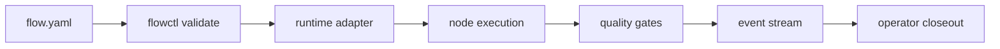

# Architecture

`agentic-flows` has three layers.

## Definition layer

The definition layer is the source of truth:

- `flows/`
- `templates/`
- `schemas/`

Each flow declares inputs, outputs, nodes, edges, runtime capabilities, quality gates, and observability events.

## Validation layer

The validation layer prevents drift:

- `tools/flowctl`
- `tests/`
- `.github/workflows/validate.yml`

Validation checks both JSON Schema rules and graph semantics that JSON Schema alone cannot express, such as missing edge targets and unreachable nodes.

## Integration layer

The integration layer tells runtimes how to consume flows:

- `integrations/common/contracts/`
- `integrations/thinclaw/`
- `integrations/nilcore/`
- `integrations/crustcore/`
- `examples/`

The independent consuming project is responsible for execution, state, permissions, sandboxing, and proof. This repository is responsible for stable workflow definitions and compatibility rules.

## Optional consumer responsibilities

These are possible mappings for independent projects. They are not claims that the projects already share a runtime or adapter layer.

| Consumer | Possible responsibility | Optional integration path |
| --- | --- | --- |
| ThinClaw | Routines, memory, channels, operator control | Load flows as durable routines and preserve decisions if an adapter exists. |
| NilCore | Worker execution, supervision, sandboxed checks | Dispatch `agent_task` and `tool` nodes if an adapter exists. |
| CrustCore | Proof, audit, verifier-owned completion | Validate gates and emit proof artifacts if an adapter exists. |
| Standalone | Local development and examples | Validate and inspect flows without a full runtime. |

## Data flow

