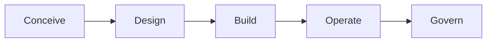

# Lifecycle and evidence reframe

> Status: **Adopted in `agentic-flows/v1.1`** (additive to `agentic-flows/v1`). The keystone evidence-class model and the spec primitives described here now ship in the live `schemas/` and are enforced by `flowctl` — see [CHANGELOG.md](../../CHANGELOG.md) and [flow-spec.md](../flow-spec.md). This document is retained as the design rationale. Flows are referred to here by their working names (`build-a-backend`, `build-a-frontend`, `design-a-website`); they shipped as `engineering.backend-service`, `engineering.frontend-build`, and `design.website-to-spec`.

## Why this proposal exists

`agentic-flows` is a runtime-neutral **contract layer**: flows authored in YAML, validated against
JSON Schema by `flowctl`, and demonstrated with event / stream / run-bundle evidence
(`docs/goals.md`, `docs/flow-spec.md`). At the time of this proposal the catalog was 64 flows across 13 categories. Almost every
flow **operates on an existing system** — it diagnoses a CI failure, reviews a PR, audits a supply
chain, routes untrusted output. Exactly one flow is greenfield: `engineering.repository-bootstrap`.

The generative, in-depth workflows people now ask for — *build a backend*, *build a frontend*,
*design a website*, and composed *build-a-whole-product* programs — do not fit cleanly. They are not
unexpressible: a `build-a-backend` flow validates against `schemas/flow.schema.json` today and can
ship a `flow.yaml` + README + sample. The wall is **evidence honesty**. Per
`docs/buildable-now.md`, a flow is "buildable end-to-end now" only when a completed standalone run
bundle is "an honest contract demonstration" rather than a misrepresentation, and generative flows
need external state — a running service, a real database, a live browser — to produce honest run
evidence. That is the same reason `engineering.browser-regression` is **deferred**
(`docs/buildable-now.md`, Defer list): its meaning depends on a live browser the repo cannot honestly
stand in for. Generative flows therefore cap at `contract-first`.

The temptation is to relax the honesty rule so these flows look "done." That would dissolve the
discipline that makes the repo worth anything: evidence over assertion, a small conservative surface,
runtime-neutrality, and the standing non-goal that the repo "should not become a dumping ground for
project-specific one-off prompts" (`docs/goals.md`).

This proposal makes generative and in-depth flows **first-class citizens without that dissolution**.
It does so with one keystone move and five additive shifts, each of which *types* external state
rather than excluding or faking it.

## The keystone reframe

Change the honesty test.

> **Old test.** A flow is complete only if its evidence is machine-checkable and repo-local **today**.

> **New test.** A flow is honest if every gate declares the **class of evidence** that backs it and
> the **environment** that produces it, and the runtime is held to producing **exactly that class**.

The old test is binary and repo-centric: evidence either reduces to a file in this repository now, or
the flow is deferred. It conflates two different things — *is the evidence well-typed?* and *can this
particular repo, with no runtime, produce it?* A backend flow whose tests genuinely run in an
ephemeral sandbox is not dishonest; it simply produces a **different class** of evidence than a
repo-local diff. The old test has no way to say so, so it lumps "honest sandbox test" together with
"fabricated production metric" and defers both.

The new test introduces a typed vocabulary for evidence and an obligation to declare it. A
`gate.completed` event that claims `deterministic` evidence and ships only a prose assertion is now a
**detectable lie** — `flowctl` can reject it. A backend test gate that declares `sandbox-run` evidence
is **honest**, and a runtime that actually stood up a sandbox can satisfy it. External state stops
being a reason to exclude a flow and becomes a *type* the flow must carry and the runtime must honor.

This preserves every original-vision invariant. "Evidence over assertion" gets *stronger*: assertion
is now the lowest, explicitly-labelled class, and mislabeling is checkable. The surface stays small:
the keystone is one enum on two existing objects. Runtime-neutrality holds: the enum names a *class*,
not a vendor. And it stays honest about its own limits — see [The guardrails](#the-guardrails):
`flowctl` runs in the repo, not in the sandbox, so it checks evidence-class **consistency**, never
**authenticity**. Authenticity is the runtime's burden, discharged with provenance signals the
authoring agent cannot forge.

The five shifts below build out the keystone. Each names: what changes, the concrete schema/doc
impact, what it unlocks, and the original-vision invariant it must preserve. They land additively as
`agentic-flows/v1.1`, a strict superset of `v1`; the companion schema files referenced throughout live
at `docs/proposals/schemas/` (`flow.schema.v1_1.json`, `event.schema.v1_1.json`,
`run.schema.v1_1.json`, `capability-registry.schema.json`, `runtime-profile.schema.json`).

## Shift 1 — Evidence model (keystone)

### What changes

Introduce an `evidence_class` enum and attach it in two places: to **quality gates** (the class the
gate's passing evidence must be) and to **event evidence items** (the class a produced artifact
actually is). The classes form a stricter-or-equal ordering:

| Class | Meaning | Who can issue it | Repo-local today? |
| --- | --- | --- | --- |
| `deterministic` | Reproducible from repo state alone: schema check, lint, type-check, a diff, a hash. | Anyone; replayable. | Yes |
| `fixture` | Computed against a checked-in fixture / recorded cassette / golden file. | Anyone; fixture is in-repo. | Yes |
| `sandbox-run` | Produced by executing against an **ephemeral** environment the runtime stood up (DB, dev-server, headless browser) and tore down. | Only a runtime that provisioned the environment. | No — needs a runtime |
| `judgment` | A recorded human/verifier decision against enumerated criteria. | A reviewer whose id is **not** the producing agent. | Partially — record is in-repo, identity is not |
| `external-production` | Depends on real, durable, outside-world state: live deployment health, real billing, production metrics, third-party connector state. | Only a runtime wired to that real system. | No — and not faked |

Ordering (`deterministic` < `fixture` < `sandbox-run` < `judgment` < `external-production` along the
axis "how much non-repo trust is required") lets a gate declare a **floor**: "evidence of class
`sandbox-run` or stricter satisfies me." A gate is **never** satisfied by evidence weaker than its
declared floor.

### Schema / doc impact

On the quality gate (`flow.schema.v1_1.json`, extending the `quality_gate` `$def` at
`schemas/flow.schema.json:285`):

```json
{
  "evidence_class": {
    "enum": ["deterministic", "fixture", "sandbox-run", "judgment", "external-production"]
  },
  "evidence_class_min": {
    "enum": ["deterministic", "fixture", "sandbox-run", "judgment", "external-production"],
    "description": "Floor: evidence of this class or stricter satisfies the gate."
  }
}
```

On event evidence items (`event.schema.v1_1.json`, extending the `evidence[]` item at
`schemas/event.schema.json:46`):

```json
{
  "evidence": {
    "items": {
      "properties": {
        "id":   { "type": "string" },
        "kind": { "type": "string" },
        "uri":  { "type": "string" },
        "sha256": { "type": "string" },
        "evidence_class": {
          "enum": ["deterministic", "fixture", "sandbox-run", "judgment", "external-production"]
        }
      },
      "required": ["kind", "uri", "evidence_class"]
    }
  }
}
```

`validate-run` gains a **class-match check**. Today `validate_run_events`
(`tools/flowctl/flowctl/cli.py:807`) already collects per-gate `evidence_refs`
(`cli.py:824`) and rejects a passed `gate.completed` whose evidence ids/kinds are disjoint from the
declared refs (`cli.py:868`). The v1.1 check adds: for a passed required gate, at least one evidence
item must carry an `evidence_class` **>= the gate's `evidence_class_min`** (or `== evidence_class`
when an exact class is pinned). A backend test gate declaring `evidence_class_min: sandbox-run` that
ships only a `deterministic` lint log fails closed.

Maturity tiers become **per evidence class**. Today a flow has one `stability`
(`experimental | preview | stable`, `schemas/flow.schema.json:42`) and `docs/buildable-now.md`
assigns one verdict (`build-now-e2e | contract-first | needs-spec-extension | defer`). Both collapse a
flow to its weakest gate. v1.1 records maturity **per class**: a flow may be `build-now-e2e` for its
`deterministic` gates and `sandbox-run`-honest (not `defer`) for its test gates. A backend flow whose
tests are truthfully `sandbox-run` is no longer unfairly pinned at `experimental` because one gate
needed a runtime — it is `preview` *for the sandbox-run class*, pending real adapter evidence, exactly
as `docs/consumer-model.md`'s promotion rule already intends.

### What it unlocks

The single most important unlock: **external state becomes typed, not excluded.** `build-a-backend`,
`build-a-frontend`, and `design-a-website` can declare honest `sandbox-run` and `judgment` gates and
be assessed on whether they declare the right class — not silently deferred for needing a runtime.

### Invariant preserved

**Evidence over assertion.** Assertion is now the *named floor* (`deterministic`/`fixture` for
in-repo, with bare prose disallowed on required gates), and class mislabeling is machine-detectable.
The rule is strengthened, not relaxed.

## Shift 2 — Environment

### What changes

Make ephemeral environments first-class. A flow may declare, per node, the **environment** the
runtime must stand up before the node runs and tear down after: an ephemeral datastore, a headless
browser, a dev server. The runtime *provisions -> runs gates against -> tears down*. This is NilCore's
stated job — `docs/core-integration.md:49` already says "NilCore owns concurrency, sandbox
boundaries, retries, and worker result collection," and `docs/architecture.md` maps NilCore to "run
`tool` plans through its sandbox boundary." The reframe gives that sandbox a typed contract.

### Schema / doc impact

Add an optional node-level `environment` object (`node.schema.v1_1.json`, extending the `node` `$def`
at `schemas/flow.schema.json:220` / `schemas/node.schema.json`):

```json
{
  "environment": {
    "type": "object",
    "additionalProperties": false,
    "required": ["provides"],
    "properties": {
      "provides": {
        "type": "array",
        "minItems": 1,
        "items": { "enum": ["ephemeral-datastore", "headless-browser", "dev-server", "build-toolchain"] }
      },
      "ephemeral": { "type": "boolean", "default": true },
      "teardown_required": { "type": "boolean", "default": true }
    }
  }
}
```

Example, a backend test node:

```yaml
- id: integration-tests
  type: tool
  title: Run integration tests against an ephemeral datastore
  description: Provision a throwaway Postgres, run the suite, capture logs, tear it down.
  tool: command-runner
  environment:
    provides: [ephemeral-datastore]
    ephemeral: true
    teardown_required: true
  produces: [integration-test-log]
```

Provisioning emits two runtime-issued events the runtime — not the authoring agent — produces:
`env.provisioned` (with the capability set and a provisioner id) and `env.torn_down`. These are added
to the events vocabulary and are the provenance backbone for `sandbox-run` evidence (see
[The guardrails](#the-guardrails)). A node that declares `environment` and a `sandbox-run` gate but
whose run bundle lacks a matching `env.provisioned` event is **incomplete**, not passing.

### What it unlocks

Backend integration tests and frontend accessibility checks become honest `sandbox-run` evidence: the
suite really executed against a real (ephemeral) datastore or a real (headless) browser, the run
bundle proves the environment existed, and nothing fabricates production state. This converts the
`engineering.browser-regression` deferral into a buildable `sandbox-run` flow: the live browser is now
a declared, ephemeral, runtime-owned environment rather than uncapturable external state.

### Invariant preserved

**Runtime-neutral by default; this repo does not own sandboxing.** `docs/goals.md` non-goals:
"This repo does not own sandboxing, permissions, memory, or approval UX." The `environment` block
*names* a capability requirement; it does **not** implement provisioning. The repo declares the
contract; the runtime (NilCore) owns the sandbox. `STANDALONE` cannot satisfy `environment` (Shift 5).

## Shift 3 — Spec primitives (additive `agentic-flows/v1.1`)

### What changes

Four opt-in primitives, each absent today and each carrying a **mandatory termination bound** and an
**evidence-aggregation rule** so that evidence extends *into* loops and fan-out instead of stopping at
the node boundary. All four are strict-superset additions: a `v1` flow is a valid `v1.1` flow
unchanged; `spec_version` advances to `agentic-flows/v1.1` only for flows that use them.

#### 3a. `parameters` — typed binding block

A top-level `parameters` block declares typed, named bindings resolved with `{{param.x}}` references
inside node `tool`, `command`, and gate `command` strings:

```yaml
parameters:
  - id: build_command
    type: command
    required: true
    description: How this stack builds. Bound per profile, never hard-coded.
  - id: package_manager
    type: text
    required: true
    default: npm
quality_gates:
  - id: build
    title: Project builds
    type: command
    required: true
    command: "{{param.build_command}}"
    evidence_class_min: deterministic
    evidence_refs: [build-log]
```

This **kills the per-stack one-off flow** and the brittle `make build || npm run build` command soup.
Instead of `build-a-node-backend`, `build-a-python-backend`, and `build-a-go-backend` as three
near-identical flows, there is one `build-a-backend` with a `build_command` parameter bound per
profile. `flowctl` validates that every `{{param.x}}` resolves to a declared parameter and that bound
values match the declared `type` — reusing the contract-field type machinery already in
`validate_contract_values` (`tools/flowctl/flowctl/cli.py:769`).

#### 3b. `iteration` — bounded revise loop

A node-level `iteration` block replaces ad-hoc cyclic back-edges (the `revise -> assess` pattern in
`general.human-in-the-loop-review`) with a bounded, declared loop:

```yaml
- id: refine
  type: agent_task
  title: Refine until acceptance passes
  description: Revise the implementation until the acceptance gate passes or the budget is exhausted.
  iteration:
    max_iterations: 5
    until: "gate:acceptance == passed"
    on_exhausted: fail            # fail | escalate | finalize-partial
```

`max_iterations` is mandatory — there is no unbounded loop. Evidence aggregation rule: each iteration
emits its own `gate.completed` evidence tagged with an `iteration` index; the loop's aggregate
evidence is the **ordered list** of per-iteration results plus the terminating condition. An exhausted
loop with `on_exhausted: finalize-partial` produces an honest *partial* bundle (see the partial-run
contract in [The guardrails](#the-guardrails)).

#### 3c. `fan_out` — parallel cardinality with per-instance evidence

A node-level `fan_out` builds N instances (N endpoints, N components) from one node, each with its own
evidence:

```yaml
- id: build-endpoints
  type: agent_task
  title: Build each declared endpoint
  description: For every endpoint in the spec, generate and test it, with per-instance evidence.
  fan_out:
    over: "{{param.endpoint_specs}}"
    cardinality: { min: 1, max: 50 }
    aggregate: all-pass            # all-pass | quorum | best-effort
```

Today a swarm is modeled as a single dispatch node (`docs/buildable-now.md`, Needs spec extension:
"today a swarm is modeled as a single dispatch node"). Evidence aggregation rule: each instance emits
`gate.completed` evidence keyed by instance id; the fan-out aggregate is defined by `aggregate`
(`all-pass` requires every instance passing; `quorum` a declared threshold; `best-effort` records
each outcome). `cardinality` bounds N — a fan-out is never unbounded.

#### 3d. `flow_ref` — sub-flow composition

A node may reference another flow as a sub-flow, letting a `build-a-whole-product` program compose
`build-a-backend`, `build-a-frontend`, and `design-a-website`. This is the largest primitive and is
**specified in full in the companion doc** `docs/proposals/sub-flow-composition.md`. In brief: a
`flow_ref` node names a target flow id + version range, maps the parent's parameters/contracts onto
the child's inputs, and **aggregates the child's run bundle** as the node's evidence. Its termination
bound is the child flow's own bound (acyclic composition only, transitively checked — see
[The guardrails](#the-guardrails)). Refer to the companion doc for the resolver, version pinning,
and evidence-rollup rules.

### What it unlocks

`parameters` makes one reusable `build-a-backend` cover every stack (killing the dumping-ground
pressure). `iteration` makes generative "revise until it passes" honest and bounded. `fan_out` makes
"build N endpoints/components" produce per-instance evidence. `flow_ref` composes the four candidates
into a single "build a whole product" program.

### Invariant preserved

**Small stable surface; execution steps are bounded.** Every primitive is opt-in and carries a
mandatory termination bound, so the closed-graph guarantees that today let `flowctl` prove
reachability (`collect_reachable`, `tools/flowctl/flowctl/cli.py:1121`) still hold: loops are bounded,
fan-out is bounded, composition is acyclic. The surface grows by four well-fenced primitives, not by
an open-ended scripting layer.

## Shift 4 — Positioning / information architecture

### What changes

Reframe the project identity from "verification contracts for **operating on existing systems**" to
"**lifecycle contracts**" spanning five phases:



Each phase has phase-appropriate evidence and its own maturity rubric:

| Phase | Question it answers | Dominant evidence classes | Example flows |
| --- | --- | --- | --- |
| Conceive | What should we build / decide? | `judgment`, `deterministic` (cited) | `research.source-backed-brief`, `docs.decision-record` |
| Design | What is the precise spec? | `judgment`, `acceptance` | `design-a-website` (proposed), `engineering.api-contract-change` |
| Build | Does the artifact exist and work? | `deterministic`, `fixture`, `sandbox-run` | `build-a-backend`, `build-a-frontend` (proposed) |
| Operate | Is the live system healthy? | `external-production` | `ops.deploy-and-verify` (deferred), `engineering.ci-failure-diagnosis` |
| Govern | Is it allowed / accepted / proven? | `judgment`, `deterministic` | `proof.verified-patch-acceptance`, `security.policy-exception` |

Reorganize the catalog **by lifecycle phase**, mapping the existing 13 categories into phases. The
Build and Design columns are **mostly empty today** — and the IA shows that as a **visible gap**, not
a silent scope assumption:

| Phase | Existing categories that map here | Density today |
| --- | --- | --- |
| Conceive | `research`, parts of `docs`, `product` | Populated |
| Design | parts of `engineering` (api-contract-change), `docs` | Thin |
| Build | `coding`, `engineering` (mostly *operating on* code, not generating it), `repository-bootstrap` | **Near-empty — the gap** |
| Operate | `ops`, `engineering` (ci/perf/regression), `personal` | Populated (much deferred) |
| Govern | `proof`, `security`, `orchestration`, `collaboration`, `general` | Populated |

The catalog gains an **evidence-class column** so each flow's honest class is legible at a glance.

### Mechanize the "no dumping ground" non-goal

`docs/goals.md` states the non-goal qualitatively: the repo "should not become a dumping ground for
project-specific one-off prompts." v1.1 makes this **machine-checkable**:

> A reusable flow under `flows/` must be **stack-agnostic** and **reusable across >= 2 profiles**.
> Project-specificity is expressed **only** via `parameters` / profiles — never hard-coded in node
> commands or gate commands.

`flowctl` enforces this with a new lint: a flow that hard-codes a stack-specific command
(`npm run build`, `pytest`) instead of a `{{param.x}}` reference, or that ships with fewer than two
binding profiles, fails the reusability check. The "one-off dumping ground" stops being a cultural
norm and becomes a CI gate.

### New gate types for creative deliverables

Generative deliverables (a design, a UI, a backend) need acceptance and judgment, not just commands.
Add two gate types alongside the existing `command | review | artifact | policy`
(`schemas/flow.schema.json:298`):

- **`acceptance`** — carries a machine-readable `acceptance_spec` with two arms: `auto` criteria
  (checkable, e.g. "Lighthouse a11y >= 90") and `scored` criteria, each requiring a `reviewer_id` and a
  `threshold`.

  ```yaml
  - id: design-accepted
    title: Design meets acceptance spec
    type: acceptance
    required: true
    evidence_class_min: judgment
    acceptance_spec:
      auto:
        - { id: a11y, check: "lighthouse.accessibility >= 90", evidence_class: sandbox-run }
      scored:
        - { id: brand-fit, reviewer_id: required, threshold: 4, scale: 5 }
    evidence_refs: [acceptance-report]
  ```

- **`judgment`** — a recorded decision against enumerated criteria, where `reviewer_id` is
  **structurally != the producing agent** (mirrors the verifier-owned pattern in
  `proof.verified-patch-acceptance`, whose whole premise is "never a model completion claim").

### What it unlocks

Design and Build become *nameable phases with their own rubrics* rather than ill-fitting entries in an
operate-centric taxonomy. The empty Build column is now a roadmap, not a blind spot. Creative
deliverables get gate types that match how they are actually accepted.

### Invariant preserved

**Explicit compatibility; no project-specific dumping ground.** The non-goal is *strengthened* from
prose to a CI rule. Phase reorganization is documentation + an additive column; it changes no live
flow.

## Shift 5 — Consumer / runtime

### What changes

Replace the free-string `required_capabilities` (today an array of arbitrary strings,
`schemas/flow.schema.json:100`) with a **classified Capability Registry** and machine-readable
**Runtime Capability Profiles**, and add a `flowctl check-profile` command that fails **closed** when a
flow needs a capability the runtime lacks.

### Schema / doc impact

`capability-registry.schema.json` (`docs/proposals/schemas/`) defines a closed set of named
capabilities, each classified by the evidence class it can produce and owned by exactly one core:

```json
{
  "capabilities": [
    { "id": "command.run",        "class": "deterministic",        "owner": "nilcore" },
    { "id": "ephemeral.datastore","class": "sandbox-run",          "owner": "nilcore" },
    { "id": "browser.headless",   "class": "sandbox-run",          "owner": "nilcore" },
    { "id": "dev.server",         "class": "sandbox-run",          "owner": "nilcore" },
    { "id": "completion.verify",  "class": "judgment",             "owner": "crustcore" },
    { "id": "deploy.observe",     "class": "external-production",  "owner": "thinclaw" }
  ]
}
```

`runtime-profile.schema.json` lets each consumer publish which capabilities it implements. `flowctl
check-profile <flow> --profile <runtime>.json` computes the flow's required capabilities (reusing the
set-difference already in the adapter-smoke validator, `tools/flowctl/flowctl/cli.py:611`,
`cli.py:615`) and **exits non-zero** if any required capability is missing from the profile. This is
the fail-closed analogue of `proof.verified-patch-acceptance`'s "accept only when every required gate
has passing evidence, otherwise reject and fail closed."

The ownership table is **advisory**: each new capability is owned by exactly one core, but listing an
owner does **not** imply the cores share a runtime — `docs/goals.md` non-goal: the repo "does not
assume ThinClaw, NilCore, and CrustCore already share APIs or runtime state." The table records
*which core would plausibly implement this*, nothing more.

**`STANDALONE` is forbidden from emitting `external-production` (and `sandbox-run`) run bundles.**
A run bundle whose `run.core == "standalone"` (`schemas/run.schema.json:40`) that contains evidence of
class `external-production` is **CI-rejected**. Standalone exists "for validation, examples, and
documentation" (`docs/goals.md`); letting it emit external-state bundles would let repo examples
fabricate the very state the honesty rule forbids. Forbidding it keeps every checked-in example honest.

### What it unlocks

A runtime can ask, before executing, "can I honestly run this flow?" and get a fail-closed answer. A
`build-a-backend` flow needing `ephemeral.datastore` is cleanly rejected by a profile that lacks it,
instead of running and silently producing mislabeled evidence.

### Invariant preserved

**No implied multi-core runtime; small surface.** Ownership is advisory; `required_capabilities`
becomes *classified*, not *coupled*. `STANDALONE`'s honesty boundary is enforced, protecting the
"evidence over assertion" guarantee at the example layer.

## The guardrails

These are what keep the reframe from becoming a Trojan horse that relabels assertion as honesty. The
foundational fact: **`flowctl` runs in this repository, not in the sandbox.** It can therefore only
check evidence-class **consistency** — that labels are internally coherent and the right shape — never
**authenticity** — that a `sandbox-run` log came from a real sandbox. Every guardrail below either
adds a non-forgeable signal or constrains what consistency-checking alone is allowed to conclude. The
docs must state this plainly, in these words: **flowctl checks consistency; authenticity is the
runtime's burden.**

### G1. Provenance, not just labels

`sandbox-run`, `external-production`, and `judgment` evidence each require a **non-self-issuable**
runtime/verifier signal the authoring agent cannot forge:

- `sandbox-run` evidence must be accompanied by matching `env.provisioned` / `env.torn_down` events
  carrying a provisioner id (Shift 2). An authoring agent can write a log file; it cannot mint a
  provisioning event attributed to a runtime it does not control.
- `external-production` evidence requires a verifier-of-record id.
- `judgment` evidence requires a `reviewer_id` (G2).

`flowctl` checks that the signal is *present and consistent*; the runtime is responsible for the
signal being *real*. The docs say so explicitly so no reader mistakes a passing `flowctl` run for proof
of execution.

### G2. Reviewer identity for `judgment` / `acceptance` gates

For `judgment` and `acceptance` gates, `reviewer_id` must be **structurally != the producing agent**
(the agent named on the node that produced the artifact). This mirrors
`proof.verified-patch-acceptance`, whose entire reason for existing is to decide acceptance "using
only verifier-owned evidence, never a model completion claim." Ship a **negative fixture** in which a
model self-scores its own design (`reviewer_id == producing agent`) and assert `flowctl` rejects it.

### G3. Honest partial runs

A **partial-evidence contract**: a failed or cancelled fan-out, or an exhausted `iteration` loop,
**retains** the per-instance / per-iteration evidence it did produce, and `validate-run` accepts an
honestly-incomplete bundle. The `run.schema.json` `status` enum already allows
`completed | failed | cancelled | running` (`schemas/run.schema.json:43`) — today `validate-run`'s
required-gate and `flow.completed` checks only fire for `status == "completed"`
(`tools/flowctl/flowctl/cli.py:877`, `cli.py:880`). The non-`completed` statuses are an **unused
hook**. The partial-run contract activates them: a `failed` bundle from a fan-out that built 7 of 10
endpoints is *valid* and carries the 7 instances' evidence, rather than being discarded as "not
completed." This is what makes generative work — which often half-succeeds — honestly representable.

### G4. Provisioning is a security boundary

Standing up an ephemeral environment is an attack surface. Add a **provisioning policy gate** covering
egress posture (can the sandbox reach the network?), toolchain source/pinning (where does the build
toolchain come from; is it pinned by digest?), and secret scope (what secrets, if any, enter the
sandbox), plus **runtime-evidenced teardown** (`env.torn_down`). This ties to existing
`security.untrusted-output-routing` and `security.policy-exception` flows — provisioning untrusted
generated code is precisely an untrusted-output-routing problem. A node with `environment` but no
provisioning policy gate fails the v1.1 lint.

### G5. Transitive composition checks + negative-fixture matrix

`flow_ref` composition is checked **transitively**: no cycles across sub-flow boundaries, version
ranges resolve, child contracts satisfy parent bindings. And — matching the repo's existing discipline
(every adapter-smoke ships a negative fixture, `tools/flowctl/flowctl/cli.py:678`) — every new semantic
rule ships **one invalid fixture** that must fail:

| New rule | Negative fixture that must fail |
| --- | --- |
| Class-match (Shift 1) | `sandbox-run` gate satisfied by a `deterministic` log. |
| Environment provenance (G1) | `sandbox-run` evidence with no `env.provisioned` event. |
| Reviewer identity (G2) | `judgment` gate where `reviewer_id == producing agent`. |
| Reusability (Shift 4) | Reusable flow hard-coding `npm run build` instead of `{{param.build_command}}`. |
| Standalone honesty (Shift 5) | `run.core == standalone` bundle carrying `external-production` evidence. |
| Bounds (Shift 3) | `iteration` node missing `max_iterations`. |
| Composition (G5) | `flow_ref` cycle. |

### G6. Cost / resource budgets

`iteration`, `fan_out`, and `environment` nodes carry **resource budgets** (max wall-clock, max
parallel instances, max provisioned environments) the runtime fails **closed** against. This extends
the existing "execution steps are bounded" guarantee from *steps* to *resources*: a fan-out that would
provision 10,000 environments is rejected before it starts.

## Phased migration

Each phase is independently shippable. Phase 0 needs zero schema work; later phases are strictly
additive. The right-hand column maps each generative candidate to the phase that makes it first-class.

| Phase | Scope | Schema work | Makes first-class |
| --- | --- | --- | --- |
| **0** | Docs only: lifecycle IA (Shift 4 reorg), catalog **evidence-class column**, rewrite the dumping-ground non-goal as the **>= 2-profile rule**. Ships now. | None | (none yet — clears the runway) |
| **1** | `agentic-flows/v1.1` additive: `parameters` (3a) + `evidence_class` (Shift 1) + Capability Registry + `check-profile` (Shift 5). | `flow.schema.v1_1.json`, `event.schema.v1_1.json`, `capability-registry.schema.json`, `runtime-profile.schema.json` | **`build-a-backend`** — its build/test gates become honest `deterministic` + `sandbox-run`-declared; one parameterized flow covers all stacks. |
| **2** | Environment / provisioning (Shift 2) + provenance (G1) + `judgment`/`acceptance` gates (Shift 4) + reviewer-identity (G2) + partial-run contract (G3) + provisioning policy (G4) + negative fixtures (G5). | `node.schema.v1_1.json`, `run.schema.v1_1.json` | **`build-a-frontend`** (a11y as honest `sandbox-run`), **`design-a-website`** (acceptance/judgment gates with non-self reviewer). |
| **3** | `iteration` + `fan_out` (3b, 3c), then `flow_ref` last (3d), with resource budgets (G6). | extends `flow.schema.v1_1.json`; `flow_ref` per `docs/proposals/sub-flow-composition.md` | **Composed `build-a-whole-product` programs** — fan-out over N components, bounded revise loops, sub-flow composition of backend + frontend + design. |

Candidate-to-phase summary:

| Candidate | First-class at |
| --- | --- |
| `build-a-backend` | Phase 1 |
| `build-a-frontend` | Phase 2 |
| `design-a-website` | Phase 2 |
| `program.build-a-whole-product` | Phase 3 |

## Closing

### New project tagline

> **agentic-flows — runtime-neutral lifecycle contracts: typed evidence from Conceive to Govern.**

(Superseding the implicit "verification contracts for operating on existing systems.")

### Relationship to `docs/goals.md`

**Non-goals rewritten:**

- *"Should not become a dumping ground for project-specific one-off prompts."* Rewritten from a
  cultural norm into a machine-checkable rule: stack-agnostic, reusable across >= 2 profiles,
  project-specificity only via `parameters` (Shift 4).

**Non-goals preserved (and in places strengthened):**

- *"Not a full workflow runtime"* — preserved. v1.1 declares environment/provisioning **contracts**;
  the runtime still owns execution.
- *"Does not own sandboxing, permissions, memory, or approval UX"* — preserved. The `environment`
  block names a capability; NilCore owns the sandbox.
- *"Does not assume the cores already share APIs or runtime state"* — preserved. The capability
  ownership table is explicitly advisory (Shift 5).
- *"Should not mark flows stable without adapter evidence"* — preserved and refined: maturity is now
  tracked **per evidence class**, but promotion past `preview` still requires real adapter/run
  evidence per `docs/consumer-model.md`.

**Relationship to `docs/buildable-now.md`:** the three evidence-honesty tiers
(`build-now-e2e` / `contract-first` / `defer`) are reframed as **per evidence class** rather than
per flow. A generative flow that was `contract-first` because one gate needed a runtime is now
`build-now-e2e` for its in-repo gates and honestly `sandbox-run`-typed for the rest — no longer lumped
with `defer`.

**Relationship to existing schemas:** all changes land in parallel files under
`docs/proposals/schemas/` (`flow.schema.v1_1.json`, `node.schema.v1_1.json`, `event.schema.v1_1.json`,
`run.schema.v1_1.json`, `capability-registry.schema.json`, `runtime-profile.schema.json`), produced
alongside this proposal. The live `schemas/*.json` are untouched until adoption; `spec_version` stays
`agentic-flows/v1` for every existing flow.

### Open questions / risks

1. **Authenticity gap is real and permanent.** `flowctl` can never prove a `sandbox-run` log is
   genuine from inside the repo. The mitigation is provenance signals (G1) plus the explicit doc
   statement that authenticity is the runtime's burden — but a colluding runtime + agent can still
   forge a consistent-looking bundle. Is that acceptable, given the live spec already trusts run
   bundles a consumer submits?
2. **Evidence-class ordering may be too linear.** Is `judgment` really "stricter" than `sandbox-run`,
   or are they orthogonal axes (machine-checkable vs. human-trusted)? A lattice may be more honest than
   a total order.
3. **Parameter binding surface.** `{{param.x}}` resolution risks reintroducing the command-soup it
   aims to kill if profiles proliferate. The >= 2-profile rule is a floor, not a ceiling; do we also
   need an upper bound on profiles per flow?
4. **`flow_ref` is the riskiest primitive.** Sub-flow composition is deliberately deferred to last
   (Phase 3) and to its own companion doc; transitive checks (G5) are necessary but the version-pinning
   and evidence-rollup design is non-trivial and may surface further bounds.
5. **Per-class maturity adds bookkeeping.** Tracking maturity per evidence class per flow is more
   metadata to keep honest; the catalog tooling must generate it, not hand-maintain it.
6. **Capability registry governance.** A closed capability set needs an owner and a change process;
   an over-eager registry could re-introduce the coupling the cores are supposed to avoid.
